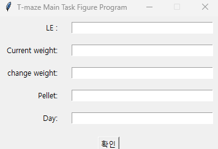
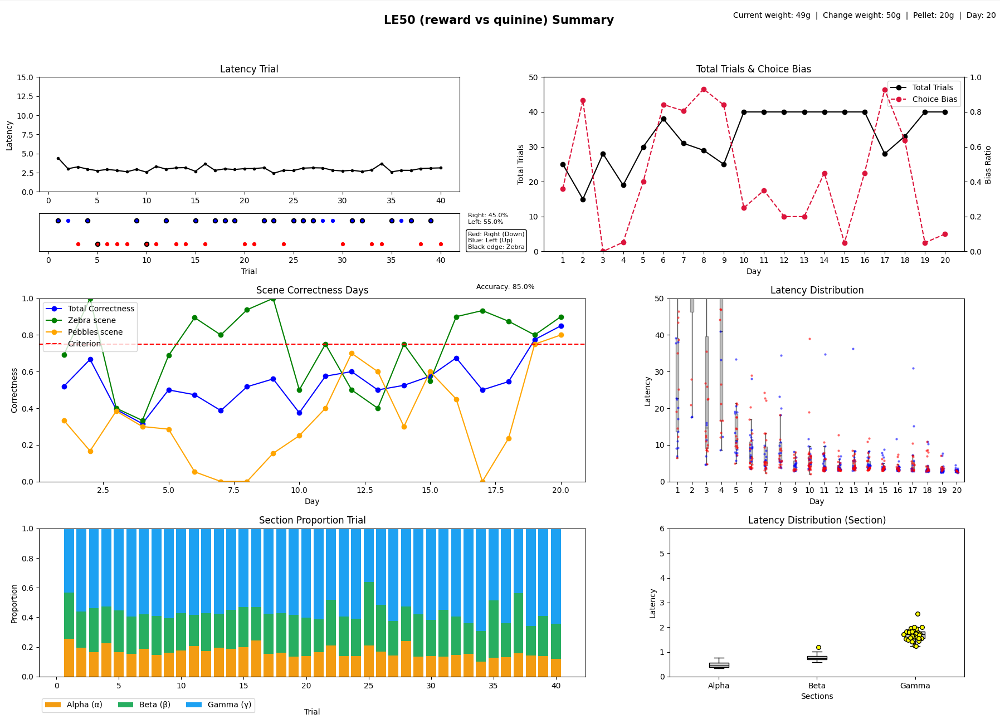

# T-maze Main Task — Daily Data Figure

A Python script for visualizing daily data from T-maze behavioral experiments (Main Task).  
Run this script after each session to review the current day's data and cumulative trends in a single figure.

---

## Features

- Per-trial Latency line plot and direction-choice dot visualization for the current session
- Day-by-day Total Trials and Choice Bias trends
- Day-by-day Correctness by scene (Zebra / Pebbles) with criterion line (75%)
- Day-by-day Latency distribution (Boxplot + Correct/Wrong strip)
- Per-trial section proportion stacked bar chart (Alpha / Beta / Gamma) for the current session
- Per-section Latency distribution Boxplot for the current session

---

## Requirements

```
Python >= 3.8
numpy
pandas
matplotlib
seaborn
tkinter  # Python standard library (no separate installation required)
```

Install dependencies:

```bash
pip install numpy pandas matplotlib seaborn
```

---

## Usage

```bash
python main_task_daily_data_table.py
```

Two GUI windows will open sequentially upon execution.

---

### 1. Folder Selection Window

Select the folder containing the session data to be analyzed.  
Example: `.../T-maze/50/main_task/`

---

### 2. Experiment Information Input Window



After selecting a folder, the following input window will appear.

| Field | Description |
|-------|-------------|
| **LE** | Experiment condition number. `49` = reward vs no reward, `50` = reward vs quinine. Reflected in the figure title. **(Required)** |
| **Current weight** | Rat's body weight measured on the day (g). Displayed in the top-right metadata of the figure. |
| **Change weight** | Body weight change compared to the previous day (g). Displayed in the top-right metadata of the figure. |
| **Pellet** | Amount of food restriction pellets provided on the day (g). Displayed in the top-right metadata of the figure. |
| **Day** | Experiment day number. Displayed in the top-right metadata of the figure. |

> Click **OK** to generate the figure. The LE field is required — leaving it blank will cause an error.

---

## Input Data Format

The selected folder must contain CSV files matching the following naming pattern:

```
{day}_Rat{id}_VSM.csv
```

Example: `1_Rat01_VSM.csv`, `2_Rat01_VSM.csv`, ...

Required columns in the CSV:

| Column | Description |
|--------|-------------|
| `Trial#` | Trial number |
| `Direction` | Choice direction (`left` / `right`) |
| `Correctness` | Outcome (`CORRECT` / `WRONG`) |
| `Scene` | Background scene (`zebra` / `pebbles`) |
| `Latency` | Total response time (seconds) |
| `Latency_stbox` | Latency for the start box section |
| `Latency_inter` | Cumulative Latency up to the intersection section |
| `TrialCorrection` / `TrialRepetition` / `TrialVoid` / `TrialSkipped` | Trial exclusion flags (trials with `YES` are excluded from analysis) |

---

## Output



After input, a figure composed of 6 subplots will be displayed.

---

### Figure Layout

#### ① Latency Trial *(top left)*

Displays the total Latency (seconds) as a line plot in trial order for the current session.  
The dot row at the bottom shows the direction choice and scene information for each trial.

- **Red dot**: Right (Down) choice
- **Blue dot**: Left (Up) choice
- **Black outline**: Zebra scene trial
- No outline: Pebbles scene trial
- Right / Left choice ratio (%) shown on the right side

---

#### ② Total Trials & Choice Bias *(top right)*

Displays two metrics per day on a dual Y-axis.

- **Black solid line (left axis)**: Total number of trials per day
- **Red dashed line (right axis)**: Choice Bias — degree of left/right selection bias (0 = balanced, 1 = fully biased)

---

#### ③ Scene Correctness Days *(middle left)*

Displays the daily correctness trend broken down by scene.

- **Blue line**: Overall correctness (Total Correctness)
- **Green line**: Zebra scene correctness
- **Orange line**: Pebbles scene correctness
- **Red dashed line**: Criterion line (75%)
- Current day accuracy (%) shown in the top right

---

#### ④ Latency Distribution *(middle right)*

Displays the daily Latency distribution using boxplots and individual data points.

- **Gray Boxplot**: Overall Latency distribution per day
- **Blue dots**: Latency of correct (CORRECT) trials
- **Pink/Red dots**: Latency of incorrect (WRONG) trials

---

#### ⑤ Section Proportion Trial *(bottom left)*

Displays the proportion of each section per trial as a stacked bar chart for the current session.

- **Orange (Alpha α)**: Start box dwell section
- **Green (Beta β)**: Movement section from Start box → Intersection
- **Blue (Gamma γ)**: Movement section from Intersection → Goal box

Each bar shows the proportion of total Latency occupied by each section on a 0–1 scale.

---

#### ⑥ Latency Distribution (Section) *(bottom right)*

Compares the Latency of the Alpha / Beta / Gamma sections using boxplots for the current session.  
**Yellow dots** indicate the section with the longest duration (maximum value) for each trial.

---

## Notes

- `LE 49`: reward vs no reward condition
- `LE 50`: reward vs quinine condition
- Latency section definitions:
  - **Alpha (α)**: Start box dwell time (`Latency_stbox`)
  - **Beta (β)**: Travel time to intersection entry
  - **Gamma (γ)**: Travel time to goal box entry
- To save the figure: use the save icon in the toolbar at the bottom of the figure window

---

## Author

Lee Lab — T-maze Behavior Analysis


Lee Lab — T-maze Behavior Analysis
